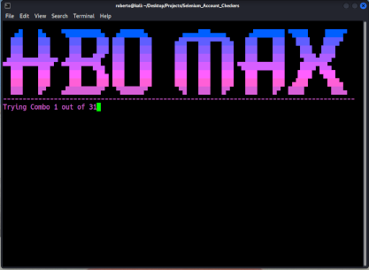

# Selenium Account Checkers



Account checker for various services, which simulates user behaviour and, as such, has near-limitless possibilties. Although checking with ```requests + beautifulsoup + proxies``` is preferred due to speed, logging in with webdriver allows (in many cases) to simulate user behaviour and prevent blocking by services. Moreover, this method is completely free and does not require paid proxies.

To launch.

``` Open a Terminal in the program's directory```
``` launch main.py in your environment of choice (i.e. python3 main.py)```

Some services are still experimental and aren't working properly, but the majority have improved functionality from the initial project.

**WARNING:**

Checking too many accounts might result in 429 response (or similar error), and there will be a cool-down period where login for current IP will be disabled.

### Requires ###

An IP Address for the service you are checking, as you will be geo-blocked otherwise (i.e. for HBO a US IP is required).

Some scripts inform you, through conditional checks on the page's existing elements, if the service will deny you access due geographical restrictions.

### Dependencies ###

Selenium webdriver, i.e.:

``` apt-get install chromium-driver ```

``` pip3 install selenium ```

``` pip3 install chromedriver-py ```

Pyshadow is now required due to the 'shadowroot' interface obfuscating some elements. This is easier than using Selenium's newly introduced 'shadow_root' attribute:

```pip3 install pyshadow```

Might require a stealthier version of chromedriver in the future.

### To do ###

- Get rid of try blocks
- Use headless for all services
- Use proper checks to determine if accounts are valid (not try blocks)
